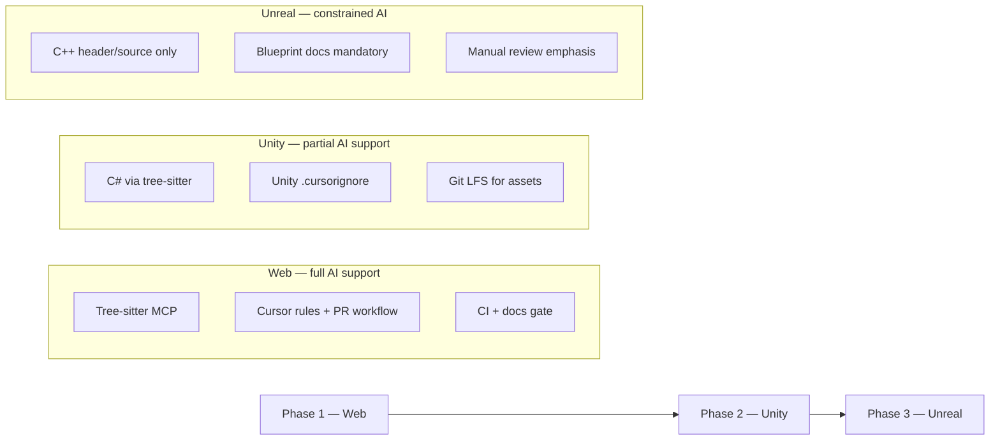
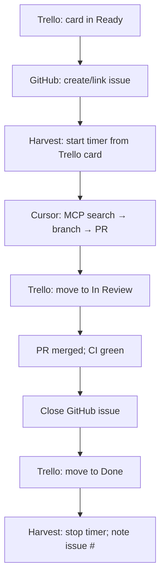

# EML AI-Assisted Development Standards — Implementation Plan

> **Emerging Media Lab (UBC)** · [eml.ubc.ca](https://eml.ubc.ca)  
> Draft plan for semester-based student teams working on web, Unity, and Unreal projects.

---

## Executive summary

This plan defines **categories of development practice**, a **phased rollout** (web → Unity → Unreal), and **enforceable standards** for source control, documentation, AI tooling, and lab operations (**Trello** + **Harvest**). The goal is consistent quality across rotating student cohorts while keeping AI assistance cost-effective and appropriate per platform.

**Core principles**

1. **AI assists; humans own decisions** — Students remain accountable for architecture, merges, and shipped behavior.
2. **Structured search before raw reads** — Use tree-sitter MCP for navigation; reserve full-file context for targeted edits.
3. **Documentation is a handoff artifact** — Every project must survive a semester turnover without oral tradition.
4. **Platform realism** — Mandate AI workflows where they work; constrain them where they fail (Unreal Blueprints, asset pipelines).
5. **One system of record per concern** — Trello for planning, GitHub for code tasks, Harvest for time; link them, don't duplicate.

---

## Practice categories

| Category | Purpose | Enforcement level |
|----------|---------|-------------------|
| [1. Environment & tooling](#1-environment--tooling) | Consistent IDE, MCP, and project setup | Required — onboarding checklist |
| [2. AI-assisted workflow](#2-ai-assisted-workflow) | When/how to use agents, rules, and skills | Required — project `.cursor/` + review |
| [3. Source control](#3-source-control) | Git hygiene, branching, assets | Required — branch protection + PR template |
| [4. Documentation](#4-documentation) | README, architecture, runbooks | Required — merge gate |
| [5. Code quality & review](#5-code-quality--review) | Linting, testing, human review | Required (web/Unity C#); recommended (Unreal) |
| [6. Collaboration & handoff](#6-collaboration--handoff) | Semester transitions, async updates | Required — end-of-term checklist |
| [7. Security & compliance](#7-security--compliance) | Secrets, UBC data, licensing | Required — zero exceptions |
| [8. Project management (Trello)](#8-project-management-trello) | Semester planning, lab-wide visibility | Required — board setup template |
| [9. Time management (Harvest)](#9-time-management-harvest) | Grant reporting, semester retros | Required — daily logging |
| [Tooling integration](#tooling-integration) | Trello ↔ GitHub ↔ Harvest ↔ Cursor | Required — linked workflow |

Categories 1–7 have **Phase 1** (mandatory for all new web projects), **Phase 2** (Unity extensions), and **Phase 3** (Unreal extensions where applicable). Categories 8–9 apply to **all active EML projects** regardless of platform.

---

## Phased rollout



| Phase | Platforms | AI maturity | Rollout target |
|-------|-----------|-------------|----------------|
| **1** | Web (React, Next, Node, static) | High — agents, MCP, CI | **Term 1** — all new web repos |
| **2** | Unity (C# gameplay, tooling) | Medium — C# strong; YAML/assets weak | **Term 2** — Unity repos adopt Phase 1 + Unity addendum |
| **3** | Unreal (C++, Blueprints) | Low — C++ snippets only; no Blueprint AI edits | **Term 3+** — optional C++ standards; Blueprint stays human-authored |

Pilot one web project in the first month of a hiring cycle, then promote standards lab-wide after retrospective.

---

## 1. Environment & tooling

### 1.1 Required IDE stack

| Tool | Role | Notes |
|------|------|-------|
| **Cursor** (or approved equivalent) | Primary AI-assisted IDE | Lab-provided license or student install |
| **Git** + **GitHub** (EML org) | Source control | SSO where UBC allows |
| **Tree-sitter MCP** | Structured code search | See [§1.2](#12-tree-sitter-mcp-standard) |
| **Node LTS** / **.NET SDK** | Web / Unity respectively | Pin versions in `.tool-versions` or `README` |

### 1.2 Tree-sitter MCP standard

**Policy:** Agents must use tree-sitter MCP tools for **discovery and navigation** before reading whole files or running broad grep across the repo.

**Why:** Raw file reads and unstructured search burn context tokens and encourage shallow edits. AST-aware search returns symbols, signatures, and references in compact form.

**Recommended server:** [codeTree](https://github.com/ThinkyMiner/codeTree) (`mcp-server-codetree`) — 23 tools, C/C++ support (Unreal), TypeScript/JavaScript (web), fast local index, no vector DB.

**Alternative:** [mcp-server-tree-sitter](https://github.com/wrale/mcp-server-tree-sitter) — mature, language-pack based.

**Lab-standard project config** (`.cursor/mcp.json`):

```json
{
  "mcpServers": {
    "codetree": {
      "command": "uvx",
      "args": [
        "--from", "mcp-server-codetree",
        "codetree",
        "--root", "${workspaceFolder}"
      ]
    }
  }
}
```

**Prerequisites:** Python 3.11+ with `uv` installed (`pip install uv` or lab bootstrap script).

**Cursor rule snippet** (`.cursor/rules/code-search.mdc`):

```markdown
---
description: Prefer structured code search over raw file reads
alwaysApply: true
---

Before reading entire files or searching with generic grep:
1. Use codetree/tree-sitter MCP tools (find_symbol, get_references, run_query).
2. Read only the line ranges returned by structured search.
3. Use full-file reads only for files under 100 lines or when editing the whole module.

Do not paste large generated assets, lockfiles, or build output into chat.
```

**Language coverage by platform**

| Platform | tree-sitter useful for | Limited / N/A |
|----------|------------------------|---------------|
| Web | `.ts`, `.tsx`, `.js`, `.css` | Generated bundles, `node_modules` |
| Unity | `.cs` scripts, Editor tooling | `.unity` YAML, prefabs, large meta |
| Unreal | `.h`, `.cpp` | Blueprints (`.uasset`), shaders |

Add `.cursorignore` per project to exclude `Library/`, `node_modules/`, `Binaries/`, `DerivedDataCache/`, etc.

### 1.3 Onboarding checklist (every student, week 1)

- [ ] GitHub access to EML org
- [ ] Cursor installed; MCP shows green in Settings → MCP
- [ ] `uv` installed; codetree starts without error
- [ ] Read this repo + project README
- [ ] Clone via SSH; run project setup script
- [ ] Complete a **guided first PR** (docs-only or trivial fix)
- [ ] Added to project **Trello board** and **Harvest** project
- [ ] Harvest ↔ Trello integration enabled; logged first time entry

---

## 2. AI-assisted workflow

### 2.1 When to use AI (by task type)

| Task | Use AI? | How |
|------|---------|-----|
| Find where X is implemented | **Yes** | tree-sitter MCP first |
| Scaffold new component/module | **Yes** | Agent + project rules |
| Write tests for existing API | **Yes** | Agent; student verifies assertions |
| Refactor with clear spec | **Yes** | Plan mode → small PRs |
| Debug with repro steps | **Partial** | Agent suggests; student validates in runtime |
| Architecture / tech choice | **No** | Human lead + ADR |
| Merge conflict resolution | **Partial** | AI explains; human resolves |
| Unreal Blueprint logic | **No** | Document manually; screenshots |
| Shader / render pipeline | **Caution** | Human review mandatory |

### 2.2 Project-level Cursor artifacts

Every repo **Phase 1+** must include:

```
.cursor/
  mcp.json              # codetree (required)
  rules/
    code-search.mdc     # MCP-first search (required)
    project.mdc         # stack, conventions, paths (required)
  (optional) skills/    # repeatable lab workflows
```

**`project.mdc` should specify:** framework versions, folder layout, naming conventions, test command, “do not edit” paths, and link to architecture doc.

### 2.3 Token and cost discipline

- Prefer **Ask / Plan** for exploration; **Agent** for bounded edits.
- Cap agent scope: one feature or bug per session where possible.
- Never commit AI output without reading the diff.
- Lab leads monitor usage if on shared Cursor team plans.

### 2.4 Platform-specific AI guidance

**Web (Phase 1 — full)**

- Agents may create files, wire routes, write tests.
- Enforce ESLint/Prettier via pre-commit.
- CI runs `lint`, `test`, `build`.

**Unity (Phase 2 — partial)**

- AI edits **C# only** in `Assets/Scripts/` (and documented Editor paths).
- Do not ask AI to edit `.unity`, `.prefab`, or Project Settings.
- Use AI for: MonoBehaviour stubs, interface design, unit tests (NUnit), XML doc comments.
- Assembly Definition boundaries documented in `project.mdc`.

**Unreal (Phase 3 — constrained)**

- AI may assist with **C++** `.h/.cpp` in whitelisted modules only.
- **Blueprints:** student-authored; require exported PNG + description in `docs/blueprints/`.
- No AI-generated changes to `.uasset`, config INI, or plugin manifests without lead approval.

---

## 3. Source control

### 3.1 Repository standards

| Rule | Requirement |
|------|-------------|
| **Hosting** | GitHub under EML org |
| **Default branch** | `main`, protected |
| **Visibility** | Private unless open-source intentional |
| **README** | Required before first merge to `main` |
| **`.gitignore`** | Platform template + lab additions |
| **No secrets in git** | Use env vars / GitHub Secrets; gitleaks in CI |

### 3.2 Branching model

```
main          ← production / demo-ready; protected
  └── feat/*  ← features (student or pair)
  └── fix/*   ← bugfixes
  └── docs/*  ← documentation-only (good first PR)
```

- Direct push to `main`: **disabled**
- Merge via **PR only**, ≥1 approval (lead or returning student)
- Branch deleted after merge

### 3.3 Commit messages

[Conventional Commits](https://www.conventionalcommits.org/) — enforced via commitlint optional, required in PR review:

```
feat(scope): add hand tracking calibration UI
fix(web): correct WebXR session cleanup
docs: update semester handoff section
chore(unity): bump URP package
```

### 3.4 Pull request requirements

PR template (`.github/pull_request_template.md`):

- **What** — one-paragraph summary
- **Why** — issue link or user story
- **How tested** — steps or CI link
- **AI disclosure** — checkbox: “AI assisted (Cursor/etc.)” + brief note
- **Docs updated** — checkbox

### 3.5 Large files & Unity/Unreal

| Platform | Policy |
|----------|--------|
| **Web** | No binaries >1 MB in git; use CDN/submodule if needed |
| **Unity** | Git LFS for `*.psd`, `*.fbx`, `*.wav`, etc.; keep `Library/` ignored |
| **Unreal** | Git LFS for content; consider Perforce for asset-heavy projects |

Provide `.gitattributes` templates in this standards repo.

### 3.6 Release & tagging (demo milestones)

- Tag `v0.x.y` before public demos or handoff
- `CHANGELOG.md` updated (Keep a Changelog format)

---

## 4. Documentation

Documentation is how EML survives **twice-yearly student turnover**.

### 4.1 Required documents (every repo)

| Document | Location | Updated when |
|----------|----------|--------------|
| **README** | `/README.md` | Setup, run, test, deploy change |
| **Architecture overview** | `/docs/architecture.md` | Major structural change |
| **Environment & secrets** | `/docs/setup.md` | Tooling or env var change |
| **Handoff notes** | `/docs/handoff.md` | End of each semester |

### 4.2 README minimum sections

1. Project title + one-line description
2. EML contact / lead
3. Prerequisites (pinned versions)
4. Quick start (≤10 commands)
5. Repository layout (tree or table)
6. Testing
7. Deployment / build targets
8. Links to `docs/`

### 4.3 Architecture doc minimum sections

1. System context (diagram — mermaid encouraged)
2. Major components and responsibilities
3. Data flow / state management
4. External services (APIs, hardware, VR runtimes)
5. Known limitations and tech debt
6. Decision log (or link to `/docs/adr/`)

### 4.4 Handoff doc (semester-end, mandatory)

Template sections:

- **Current state** — what works, what is broken
- **In progress** — branches, WIP PRs
- **Next priorities** — ordered list for incoming cohort
- **Gotchas** — environment quirks, hardware IDs, UBC VPN, etc.
- **Key contacts** — vendors, UBC IT, previous students

### 4.5 Unity / Unreal additions

| Platform | Extra docs |
|----------|------------|
| **Unity** | Scene list, build settings screenshot, input map, package manifest notes |
| **Unreal** | Level map, Blueprint catalog (`docs/blueprints/`), module map for C++ |

### 4.6 AI-generated documentation policy

- AI may **draft** docs; student must **verify accuracy** before merge.
- Doc-only PRs encouraged for onboarding practice.
- Architecture claims must match code — leads spot-check each term.

---

## 5. Code quality & review

### 5.1 Web (Phase 1)

| Check | Tool |
|-------|------|
| Lint | ESLint |
| Format | Prettier |
| Types | TypeScript strict |
| Test | Vitest/Jest — critical paths covered |
| CI | GitHub Actions on every PR |

### 5.2 Unity (Phase 2)

| Check | Tool |
|-------|------|
| Format / analyzers | `.editorconfig`, Unity analyzers |
| Test | Edit Mode tests for pure C# logic |
| Review | No AI-edited YAML; scene changes need screenshot in PR |

### 5.3 Unreal (Phase 3)

| Check | Tool |
|-------|------|
| Format | `.clang-format` for C++ modules |
| Review | Human review for all C++; Blueprint changes need doc update |

### 5.4 Human review norms

- Reviewers check **behavior**, not just syntax.
- Ask: “Could the next student understand this without asking me?”
- AI-assisted PRs: reviewer confirms tests and docs, not just green CI.

---

## 6. Collaboration & handoff

### 6.1 Semester rhythm (aligned with hiring)

| Week | Activity |
|------|----------|
| 1–2 | Onboarding checklist, docs-only PR, MCP setup |
| 3–10 | Feature development, weekly async status |
| 11–12 | Handoff doc, tag release, retrospective |

### 6.2 Async communication

- **Trello** — planning, semester roadmap, non-code work (see [§8](#8-project-management-trello))
- **GitHub Issues** — authoritative tracker for anything that ships in git (bugs, features, PRs)
- **Harvest** — time logged daily against Trello cards (see [§9](#9-time-management-harvest))
- **Weekly note** — 3 bullets on the active Trello card: done / doing / blocked

### 6.3 Pairing & knowledge spread

- No single “hero” owner per subsystem — rotate pairs mid-semester where possible.
- Returning students mentor for first 2 weeks.
- Record **5-minute Loom/video** for complex setup (optional but encouraged).

### 6.4 End-of-term checklist (leads)

- [ ] `docs/handoff.md` complete
- [ ] All open PRs merged or closed with notes
- [ ] `main` builds and runs from clean clone
- [ ] Access reviewed (remove departing students)
- [ ] Retrospective: what worked in AI workflow?
- [ ] Trello board archived or `Handoff notes` list finalized
- [ ] Harvest time summary exported into `docs/handoff.md`

---

## 7. Security & compliance

| Rule | Detail |
|------|--------|
| **Secrets** | Never in repo; use `.env.example` only |
| **UBC data** | Follow UBC IT policies; no student records in repos |
| **Third-party AI** | No pasting confidential research data into public models |
| **Licenses** | OSS license file; track Unity/Unreal asset store licenses |
| **Dependencies** | Dependabot or manual monthly review for web |

Add gitleaks or GitHub secret scanning on all org repos.

---

## 8. Project management (Trello)

EML uses **Trello** for semester planning, lab-wide visibility, and work that does not map cleanly to a GitHub issue (creative pipeline, hardware booking, demo prep). **GitHub Issues remain authoritative for code work** — every development card must link to an issue before moving to **In Progress**.

Full board setup: [`templates/trello/board-setup.md`](templates/trello/board-setup.md)

### 8.1 Board structure

**One board per active project** (named by project codename). Optionally maintain one **EML Lab** board for cross-project ops (equipment, hiring, shared infra).

Standard lists:

```
Backlog → Ready → In Progress → In Review → Done → Handoff notes
```

| List | Meaning |
|------|---------|
| **Backlog** | Ideas and future-term work; tagged `this-term` or `future` |
| **Ready** | Scoped, has owner, meets Definition of Ready |
| **In Progress** | Active work; Harvest timer running or time logged |
| **In Review** | PR open or awaiting lead review |
| **Done** | Merged/shipped; GitHub issue closed |
| **Handoff notes** | End-of-term context that doesn't belong in a Done card |

### 8.2 Labels (standard set)

Apply on every project board:

| Label | Color (suggested) | Use |
|-------|-------------------|-----|
| `web` | Blue | Web stack |
| `unity` | Green | Unity project |
| `unreal` | Purple | Unreal project |
| `vr` | Orange | VR-specific work |
| `this-term` | Yellow | Committed for current semester |
| `future` | Gray | Explicitly deferred |
| `blocked` | Red | Waiting on external dependency |
| `non-code` | Black | No GitHub issue required (equipment, admin) |

Add project-specific labels sparingly; prefer GitHub issue labels for technical detail.

### 8.3 Custom fields

Enable Trello **Custom Fields** Power-Up on each board:

| Field | Type | Required when |
|-------|------|---------------|
| **GitHub issue** | URL | Card enters **In Progress** (except `non-code`) |
| **Owner** | Text or member | Card enters **Ready** |
| **Grant / client code** | Dropdown | Matches Harvest client/project mapping |
| **Est. hours** | Number | Optional; useful for scope conversations |

### 8.4 Card conventions

Use the card description template: [`templates/trello/card-template.md`](templates/trello/card-template.md)

**Title format:** `[WEB|UNITY|UE|OPS] Short description` — platform prefix only; project identity is the board name (codename).

**Rules:**

- No card in **In Progress** without an owner and (for code work) a GitHub issue link.
- No PR without a linked Trello card in **In Review**.
- Move to **Done** only when GitHub issue is closed and PR merged.
- `non-code` cards skip GitHub but still require Harvest time.

### 8.5 Definition of Ready / Done

**Definition of Ready** (card may enter **Ready**):

- [ ] Acceptance criteria written (2–5 bullets)
- [ ] Platform label applied
- [ ] Owner assigned
- [ ] Tagged `this-term` or `future`
- [ ] For code work: GitHub issue created (may stay empty until **In Progress**)

**Definition of Done** (card may enter **Done**):

- [ ] Deliverable complete (merged PR, asset delivered, etc.)
- [ ] GitHub issue closed (if applicable)
- [ ] Docs updated if behavior changed
- [ ] Harvest time logged with issue/card reference in notes
- [ ] Demo milestone noted if applicable

### 8.6 Trello automations (Butler)

Recommended rules — enable on each project board:

| Trigger | Action |
|---------|--------|
| Card moved to **In Progress** | Add checklist item: "GitHub issue linked" if field empty |
| Card moved to **In Review** | Post comment: "Link PR in GitHub issue; ensure CI green" |
| Card moved to **Done** | Archive checklist; add due-date stamp comment |
| Label `blocked` added | Notify board lead (Butler notification or @mention) |

Enable the **GitHub Power-Up** on each board to attach PRs and issues to cards.

### 8.7 Scope fence for semesters

At term start, leads tag backlog cards `this-term` vs `future`. Only `this-term` cards may enter **Ready** without lead approval. At handoff, move incomplete `this-term` cards to **Handoff notes** with status comment — never silently leave work in **In Progress**.

---

## 9. Time management (Harvest)

EML uses **Harvest** for time tracking, grant reporting, and semester retrospectives. Projects use existing **codenames** — Harvest project names must match the Trello board codename and linked GitHub repo where applicable.

### 9.1 Harvest structure

| Harvest entity | EML mapping |
|----------------|-------------|
| **Client** | Funding source or `EML Internal` |
| **Project** | Project codename (same as Trello board name) |
| **Task** | Standard task list below — consistent across all projects |
| **Notes** | Required: Trello card URL and/or GitHub issue `#123` |

### 9.2 Standard task categories

Use the same task names on every Harvest project:

| Task | Log when |
|------|----------|
| **Development** | Writing code, configs, shaders (non-AI or mixed) |
| **AI-assisted dev** | Cursor/agent sessions for implementation |
| **Design** | UI/UX, concept art, level layout |
| **Research** | Spikes, evaluating tools, reading docs |
| **Documentation** | README, architecture, handoff, Blueprint exports |
| **Meetings** | Standups, client/faculty meetings, lab meetings |
| **VR / hardware testing** | Headset testing, device setup, build verification |
| **Admin** | Onboarding, access requests, license management |

Tag AI-assisted work explicitly — after a semester, compare `AI-assisted dev` hours against rework rates to inform Cursor licensing decisions.

### 9.3 Logging practices

- **Log daily** or at end of each work session — no weekly batch from memory.
- **Start timer from Trello** via [Harvest Trello integration](https://www.getharvest.com/apps/trello) when beginning focused work.
- **Notes are mandatory** for Development and AI-assisted dev: include GitHub issue number.
- **Do not log** idle time, social browsing, or unrelated coursework.

### 9.4 Budgets and lead review

- Set **project budgets** in Harvest per grant or semester allocation.
- Leads review Harvest vs Trello **Done** column **monthly** (15 min): catch logging drift and scope creep.
- Alert thresholds at 75% and 90% of budget trigger a scope conversation with the team.

### 9.5 Semester handoff export

At term end, export a Harvest report (by task, by person) for the project and append summary to `docs/handoff.md`:

- Total hours by task category
- Notable spikes or bottlenecks (e.g. VR testing, asset pipeline)
- Carry-over work vs original `this-term` scope

---

## Tooling integration

EML tools form a linked workflow. Each system owns one concern; integrations are links and IDs, not duplicated descriptions.

### System of record

| Concern | System of record | Linked from |
|---------|------------------|-------------|
| Semester planning & visibility | **Trello** | README, handoff doc |
| Code, PRs, CI | **GitHub** | Trello custom field, Harvest notes |
| Time & grant reporting | **Harvest** | Trello timer integration |
| Technical knowledge | **Repo `docs/`** | Trello card descriptions (one-line + link) |
| AI-assisted development | **Cursor** + MCP | PR AI disclosure checkbox |

### End-to-end feature workflow



### Integration checklist (new project)

- [ ] Trello board created from [`templates/trello/board-setup.md`](templates/trello/board-setup.md)
- [ ] Harvest project created under correct client; codename matches Trello board
- [ ] Harvest ↔ Trello integration connected for the board
- [ ] GitHub repo created; README links to Trello board URL
- [ ] GitHub Power-Up enabled on Trello board
- [ ] Standard labels, custom fields, and Butler rules applied
- [ ] All students invited to Trello board and Harvest project

### Linking rules (no orphan work)

| Rule | Detail |
|------|--------|
| **No orphan PRs** | Every PR references a GitHub issue |
| **No orphan issues** | Every dev issue links from a Trello card |
| **No untracked dev time** | Development and AI-assisted dev require Harvest entry with issue `#` |
| **Single description source** | Detailed spec lives in GitHub issue; Trello card has summary + link |
| **Non-code exception** | Ops/creative cards labeled `non-code` — Trello + Harvest only |

### Optional integrations (recommended)

| Integration | Benefit |
|-------------|---------|
| **GitHub MCP** in Cursor | Agents read issues/PRs without pasting context |
| **GitHub Actions → Trello** | Auto-comment on card when CI fails (via API/Butler) |
| **Sentry** (web projects) | Error links in GitHub issues; survives student turnover |
| **1Password Teams** | Secrets referenced in `docs/setup.md`; never in Trello/GitHub |

### Weekly async status

Students update the **active Trello card** with three bullets (not a separate doc):

```
Done: …
Doing: …
Blocked: …
```

Leads scan boards once per week; no standup meeting required unless `blocked` persists >3 days.

---

## Implementation roadmap

### Term 1 — Foundation (web-first)

| Week | Deliverable |
|------|-------------|
| 1 | Publish this plan; create standards repo structure |
| 2 | `.cursor/mcp.json` + rules templates; Trello board template; **`template/` GitHub project scaffold** |
| 3 | PR template, README template, handoff template; Harvest task list documented |
| 4 | Pilot on one active web project |
| 6 | Retro; adjust rules |
| 8 | Mandate for all **new** web repos |
| 12 | First semester handoff using new templates |

### Term 2 — Unity extension

- Unity `.gitattributes` + LFS template
- Unity-specific `project.mdc` and `.cursorignore`
- C#-only AI policy communicated in onboarding
- Pilot on one Unity VR/non-VR project

### Term 3 — Unreal extension (optional depth)

- C++ module whitelist policy
- Blueprint documentation workflow
- Evaluate Perforce vs Git LFS for asset-heavy projects

---

## Standards repo structure (this repository)

Proposed layout to materialize from this plan:

```
eml-ai-coding-standards/
├── README.md                 # Quick start for lab leads
├── PLAN.md                   # This document
├── templates/
│   ├── cursor/
│   │   ├── mcp.json
│   │   └── rules/
│   ├── github/
│   │   ├── pull_request_template.md
│   │   └── workflows/ci-web.yml
│   ├── docs/
│   │   ├── README.template.md
│   │   ├── architecture.template.md
│   │   └── handoff.template.md
│   ├── git/
│   │   ├── gitignore.web
│   │   ├── gitignore.unity
│   │   └── gitattributes.unity
│   ├── trello/
│   │   ├── board-setup.md
│   │   └── card-template.md
│   └── github-template-setup.md
├── template/                 # GitHub project template (→ eml-project-template repo)
│   ├── .cursor/              # mcp.json + rules (codetree)
│   ├── .github/
│   ├── docs/
│   └── README.md
├── checklists/
│   ├── student-onboarding.md
│   └── semester-handoff.md
└── platform-addenda/
    ├── web.md
    ├── unity.md
    └── unreal.md
```

---

## Success metrics

| Metric | Target (after 2 semesters) |
|--------|----------------------------|
| Repos with MCP + rules | 100% of new repos |
| README + architecture present | 100% before term-end |
| Handoff doc completed | 100% of active projects |
| PRs with AI disclosure | Track; aim for transparency |
| Clean clone → run | ≤30 min for web; documented for Unity/Unreal |
| Lead time for new student first merge | ≤1 week (docs PR) |
| Trello cards with GitHub issue link (dev work) | 100% in **In Progress**+ |
| Harvest entries with issue/card reference (dev time) | ≥95% compliance |
| Monthly Harvest vs Trello reconciliation | Leads complete 12×/year |

---

## Open decisions (for lab leads)

1. **Cursor Team vs individual licenses** — budget and admin model; use Harvest `AI-assisted dev` data to inform
2. **Primary tree-sitter MCP** — codetree vs mcp-server-tree-sitter (pick one for support consistency)
3. **Unreal asset VCS** — Git LFS vs Perforce for large projects
4. **CI runners** — GitHub-hosted vs UBC self-hosted for VR build agents
5. **Mandatory vs recommended** — which Phase 2/3 rules are merge-blocking

---

## References

- [Model Context Protocol](https://modelcontextprotocol.io/)
- [codeTree MCP](https://github.com/ThinkyMiner/codeTree)
- [Cursor MCP docs](https://docs.cursor.com/context/model-context-protocol)
- [Conventional Commits](https://www.conventionalcommits.org/)
- [Keep a Changelog](https://keepachangelog.com/)
- [Harvest Trello integration](https://www.getharvest.com/apps/trello)
- [Trello GitHub Power-Up](https://trello.com/power-ups)

---

*Document version: 0.2 · Last updated: 2025-06-24*
