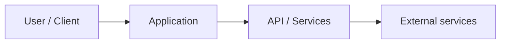

# Architecture — CODENAME

> Update this document when structure or major behavior changes. AI may draft sections; humans must verify against the code.

## System context

Replace the diagram with your actual system.

## Components

| Component | Location | Responsibility |
|-----------|----------|----------------|
| _Example_ | `src/` | _Describe_ |

## Data flow

1. _Describe primary request/data path_
2. _State management approach_
3. _Persistence if any_

## External services

| Service | Purpose | Config |
|---------|---------|--------|
| _None yet_ | | See `docs/setup.md` |

## Build & deploy targets

| Target | Notes |
|--------|-------|
| Local dev | `npm run dev` |
| Production | _TBD_ |

## VR / hardware (if applicable)

- Headsets:
- Input:
- Build targets:

## Known limitations & tech debt

- _List honestly — helps the next cohort_

## Decisions

Significant choices are recorded in `/docs/adr/` (create as needed) or summarized here:

| Date | Decision | Rationale |
|------|----------|-----------|
| | | |
